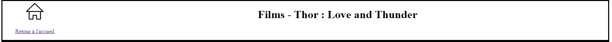

# sae2-01

## Auteurs

HALES Nadhir : hale0010
MORLET Steven : morl0027

 

## Description du projet

### Arborescence 

- <strong>\ </strong> (racine)
  - **bin** (fichiers de lancement du serveur)
  - **public** (scripts de pages principales du site)
    - **confirmEditData** (pages de vérifications pour modification de données : movies/people)
    - **css** (styles des différentes pages)
    - **menus** (scripts de menus pour modification de données)
  - **src** (fichiers et scripts nécessaires au fonctionnement du site)
    - **Database** (fichiers de base de données : classe MyPdo)
      - **Images** (images par défaut pour movies/people)
    - **Entity** (classes)
      - **Collection** (classes qui sont des ensembles d'autres classes)
      - **Exception** (classes d'exception)
    - **Html** (fichiers nécessaires à la création semi-automatique de pages web : classe WebPage)

### Mise en route du serveur

- Sur windows : `composer start` ou `composer start:windows`

- Sur Linux : `composer start:linux`

Adresse du serveur : 
> http://localhost:8000/

### Important

Pour faciliter le développement et la revue du projet, nous avons utilisé la 
méthode GET au lieu de POST, bien que nous sachions que celle-ci soit moins sécurisée.

 

## Documentation

### Composer :

**Installation des dépendances du projet :**  

`Composer Install`

**Mise à jour des dépendances du projet :**  

`Composer Update`

 

### Classes :

Movie, People, Image sont les seules classes de ce projet car elles sont les seules que nous avons utilisées.

Les classes sont toutes construites de cette facon :

Les attributs de la classe sont issus de  la base de donnée et portent le meme nom que dans celle-ci, chacun des attribut possède un accesseur et un mutateur et chaque classe possède une methode "findById" qui permet à partir de l'id d'un enregistrement de la base de donnée de renvoyer l'instance lui correspondant.
Collections :

Elles sont des classes dont l'objectif est de renvoyer sous forme de tableau l'ensemble des entités d'un autre classe,

Les deux collections de notre projet sont Movie et People.

ces classes possèdent une seule méthode "findAllMovies" qui à l'image de findById renvoie un tableau de toutes les instances de la classe présente dans la base de données.

 

### MyPdo.ini :

Fichier de configuration de PDO stockant les informations de connexion à la base de donnée, ce fichier est à créer à chaque installatio et à configurer avec les acces BD, celui-est essentiel pour les interactions avec la BD car il est appelé à chaque requete.

 

### .php-cs-fixer.php :

Fichier permettant la mise en forme selon la recommandation PSR-12 via la commande "composer fix:cs", il remet en forme les fichiers php.

 

### composer.json :

fichier de configuration de composer, contient la liste de dépendances, les auteurs et les scripts composer.

 

### .gitignore :

fichier contenant l'ensemble des fichers et dossier non rescensés dans le dépot git.

 

### Fonctionnalités :

**Page d'accueil :** 

- Liste des films

La page d'accueil comporte la liste des films ainsi qu'un lien vers chacun d'eux. L'affichage
de leurs images sur tout le site se fait grâce aux programmes poster (pour les films) et
vignette (pour les acteurs) qui utilisent la classe image. Quand une image n'est pas trouvée on
en affiche une par défaut.

- Trier les films : 

D'abord nous récupérons la liste des themes, et leurs id. Lorsqu'on valide le formulaire le scripte envie via la methode Get l'id du theme, ensuite dans le code se trouve une requete qui va récupérer tout les films du type de l'id , enfin nous les affichons
Par defaut tout les films sont afficher
Nous avons ajouté un bouton afin de retourner sur la page d'acceuil

- Ajouter un film, un(e) acteur/ice : 

Le principe est le même que ce soit pour ajouter un film ou un(e) acteur/ice.  
On commence par ajouter un bouton sur la page d'accueil pour ces options.

Puis par un clic sur ce bouton, nous renvoyons vers la page d'un formulaire d'ajout. 
Ces formulaires se trouvent dans le dossier "menus" de "public".
Les données récupérées par ces formulaires sont envoyées vers des programmes de 
confirmation, qui se trouvent dans le dossier "confirmEditData" de "public". Qui 
traitent les données et les sécurisent avec des exceptions, puis les passe dans
des requêtes SQL (INSERT) préparées pour ajouter un nouvel enregistrement dans la table correspondante.

 

**Page d'un film ou acteur/ice :** 

- Revenir à la page d'accueil :

Un bouton est disponible pour revenir à la page d'accueil. 
C'est un simple lien vers index.php.

- Modifier un film ou acteur/ice : 

Pour modifier un enregistrement nous passons encore par un formulaire (menus)
qui renvoie ses paramètres vers un programme de vérification (confirmEditData)
pour exécuter une requête SQL (UPDATE).

- Supprimer un film ou acteur/ice : 

Pour supprimer un film ou acteur/ice nous mettons simplement une page d'avertissement
après un clic sur le bouton de suppression. Cet avertissement est composé d'un formulaire (menus)
qui ne renvoie qu'une valeur binaire ainsi que l'id du film vers son propre programme.
Si on n'est pas sûr de vouloir supprimer le film, on nous renvoie vers la page du film et si on
est sûr le programme exécute la requête préparée de suppression. Après la suppression on nous
renvoie vers la page d'accueil.

